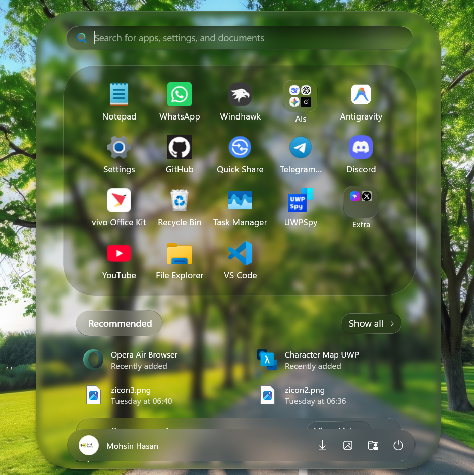
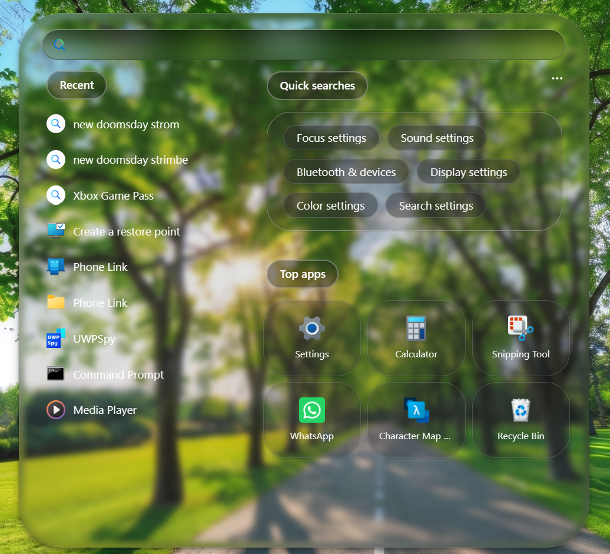

# LiquidGlass theme for Windows 11 Start Menu Styler

**Author**: [MohsinHasanPc](https://github.com/mohsinhasanpc)




> [!IMPORTANT]
> This theme is designed for the [redesigned Windows 11 Start menu](https://microsoft.design/articles/start-fresh-redesigning-windows-start-menu/) that is gradually rolling out with the 25H2 update.

> [!NOTE]
> This theme is made for Dark mode only.

## Theme selection

The theme is integrated into the mod and can be selected directly from the mod's
settings:

* Open the Windows 11 Start Menu Styler mod in Windhawk.
* Go to the "Settings" tab.
* Select the theme and save the settings.

## Manual installation

The theme styles can also be imported manually. To do that, follow these steps:

* Open the Windows 11 Start Menu Styler mod in Windhawk.
* Go to the "Settings" tab and select "Textual mode".
* Copy the content below to the text box and click "Save settings".

<details>
<summary>Content to import (click to expand)</summary>

```yaml
disableNewStartMenuLayout: default
styleConstants:
  - Glass=<WindhawkBlur BlurAmount="5" TintColor="{ThemeResource SystemChromeMediumColor}" TintOpacity="0.1" />
  - Frosted=<WindhawkBlur BlurAmount="15" TintColor="{ThemeResource SystemChromeMediumColor}" TintOpacity="0.3" />
  - Acrylic=<AcrylicBrush TintColor="{ThemeResource SystemChromeMediumColor}" TintOpacity="0" FallbackColor="{ThemeResource SystemChromeMediumColor}" />
  - BorderBrush=<LinearGradientBrush StartPoint="0,0" EndPoint="0,1"><GradientStop Color="#50808080" Offset="0.0" /><GradientStop Color="#50404040" Offset="0.25" /><GradientStop Color="#50808080" Offset="1" /></LinearGradientBrush>
  - BorderBrush2=<WindhawkBlur BlurAmount="10" TintColor="#909090" TintOpacity="0.3"/>
  - ClockBG=<WindhawkBlur BlurAmount="15" TintColor="{ThemeResource SystemAccentColorLight2}" TintOpacity="0.3" />
  - BorderThickness=0.3,1,0.3,1
  - CornerRadius=25
  - ElementBG=<SolidColorBrush Color="{ThemeResource SystemChromeAltHighColor}" Opacity="0.30" />
  - ElementBorderThickness=0.3,0.5,0.3,1
  - ElementCornerRadius=20
  - ElementBorderBrush=<LinearGradientBrush StartPoint="0,0" EndPoint="0,1"><GradientStop Color="#50808080" Offset="1" /><GradientStop Color="#50606060" Offset="0.15" /></LinearGradientBrush>
  - ElementBorderBrush2=<WindhawkBlur BlurAmount="30" TintColor="#909090" TintOpacity="0.3"/>
  - GlassDark=<WindhawkBlur BlurAmount="5" TintColor="#1A000000" />
  - GlassDark2=<WindhawkBlur BlurAmount="5" TintColor="#0D000000" />
  - GlassDarkTitles=<WindhawkBlur BlurAmount="7" TintColor="#10151515"/>
  - GlassDarkBottomTray=<WindhawkBlur BlurAmount="14" TintColor="#3E4A4A4A"/>
  - fluidBorder=<LinearGradientBrush StartPoint="0,0" EndPoint="0,1"><GradientStop Offset="0" Color="#2FFFFFFF" /><GradientStop Offset="0.2" Color="#1AFFFFFF" /><GradientStop Offset="0.65" Color="#1AF0F0F0" /><GradientStop Offset="1" Color="#2F707070" /></LinearGradientBrush>
  - fluidNormal=<SolidColorBrush Color="{ThemeResource ControlFillColorDefault}" />
  - fluidHover=<SolidColorBrush Color="{ThemeResource ControlFillColorSecondary}" />
  - fluidPressed=<SolidColorBrush Color="{ThemeResource ControlFillColorTertiary}" />
  - GlassDarkSearchPage=<WindhawkBlur BlurAmount="4" TintColor="#1F000000"/>
controlStyles:
  - target: Border#AcrylicOverlay
    styles:
      - Margin=0
      - BorderThickness=0
      - CornerRadius=10
      - Visibility=Collapsed
  - target: Border#AcrylicBorder
    styles:
      - Background:=$GlassDark
      - CornerRadius=62,62,58,58
      - BorderThickness=$BorderThickness
      - BorderBrush:=$BorderBrush
  - target: Grid#Root > Border
    styles:
      - BorderBrush:=<LinearGradientBrush StartPoint="0,0" EndPoint="0,1"><GradientStop Color="#40B5B5B5" Offset="0.0" /><GradientStop Color="#40B5B5B5" Offset="0.3" /><GradientStop Color="#20050505" Offset="0.45" /><GradientStop Color="#40040404" Offset="0.75" /><GradientStop Color="#20050505" Offset="0.85" /><GradientStop Color="#40ACACAC" Offset="1" /></LinearGradientBrush>
      - Background:=$GlassDark2
      - BorderThickness=1,1,1,1
      - CornerRadius=62,62,58,58
  - target: StartMenu.StartHome > Grid#PageRoot
    styles:
      - Margin=10
      - Padding=0,0,0,0
  - target: Grid#MainMenu
    styles:
      - Padding=0,0,0,0
  - target: Grid#OuterBorderGrid
    styles:
      - CornerRadius=0
      - Padding=0
  - target: Border#AppBorder
    styles:
      - Background:=$GlassDarkSearchPage
      - BorderBrush:=<LinearGradientBrush StartPoint="0,0" EndPoint="0,1"><GradientStop Color="#40B5B5B5" Offset="0.0" /><GradientStop Color="#40B5B5B5" Offset="0.1" /><GradientStop Color="#10050505" Offset="0.3" /><GradientStop Color="#10040404" Offset="0.5" /><GradientStop Color="#10050505" Offset="0.75" /><GradientStop Color="#40ACACAC" Offset="1" /></LinearGradientBrush>
      - BorderThickness=0.5,1,0.5,1
      - CornerRadius=58
  - target: TextBox#MutableFolderNameTextBox > Grid@CommonStates > Border#BorderElement
    styles:
      - Background:=<WindhawkBlur BlurAmount="15" TintColor="#15151515"/>
      - BorderBrush:=<LinearGradientBrush StartPoint="0,0" EndPoint="0,1"><GradientStop Color="#70D3D3D3" Offset="0.0" /><GradientStop Color="#50696969" Offset="0.5" /><GradientStop Color="#653C3C3C" Offset="1" /></LinearGradientBrush>
      - BorderThickness=1,0.5,1,1
      - CornerRadius=20
  - target: Border#BackgroundBorder
    styles:
      - CornerRadius=20
  - target: Grid#ContentBorder
    styles:
      - CornerRadius=10
  - target: Border#LayerBorder
    styles:
      - CornerRadius=50
  - target: StartMenu.StartBlendedFlexFrame
    styles:
      - Width=Auto
      - Height=Auto
  - target: Border#BorderUnderline
    styles:
      - Visibility=Visible
  - target: Windows.UI.Xaml.Controls.Primitives.ScrollBar#VerticalScrollBar
    styles:
      - RenderTransform:=<TranslateTransform X="0" Y="0" />
  - target: Grid#DroppedFlickerWorkaroundWrapper > Border#BackgroundBorder
    styles:
      - Background@PointerOver:=$Glass
      - Background@Pressed:=$Glass
      - Background@Selected:=$Glass
  - target: Border#StartDropShadow
    styles:
      - CornerRadius=58
      - Margin=0.3,0,0.3,0
      - Visibility=Visible
      - BorderThickness=7.5,9.5,7.5,8
      - Background:=Transparent
      - BorderBrush:=<WindhawkBlur BlurAmount="60" TintColor="#100F0F0F"/>
  - target: Border#RootGridDropShadow
    styles:
      - CornerRadius=50
      - Margin=0.4,0,0.3,0
      - Canvas.ZIndex=-1
  - target: Grid#TopLevelHeader > Grid > Button
    styles:
      - RenderTransform:=<TranslateTransform X="0" Y="-5" />
  - target: Grid#TopLevelHeader > Grid > Button
    styles:
      - Visibility=1
  - target: Grid#NavPanePlaceholder
    styles:
      - RenderTransform:=<TranslateTransform X="0" Y="0" />
      - Background:=$GlassDarkBottomTray
      - BorderBrush:=<LinearGradientBrush StartPoint="0,0" EndPoint="0,1"><GradientStop Color="#70D3D3D3" Offset="0.0" /><GradientStop Color="#50404040" Offset="0.1" /><GradientStop Color="#69404040" Offset="0.25" /><GradientStop Color="#60292929" Offset="0.5" /><GradientStop Color="#69404040" Offset="0.75" /><GradientStop Color="#50404040" Offset="0.9" /><GradientStop Color="#70C1C1C1" Offset="1" /></LinearGradientBrush>
      - CornerRadius=25
      - BorderThickness=1.2,1,1.2,1
      - Height={{MenuHeight * 0.069}}
      - MinHeight=52
      - MaxHeight=56
      - Padding=5,0,5,0
      - Margin:=10,0,0,10
      - Width={{MenuWidth * 0.89}}
      - MinWidth:=200
      - Canvas.ZIndex=10
  - target: Microsoft.UI.Xaml.Controls.DropDownButton#ViewSelectionButton
    styles:
      - RenderTransform:=<TranslateTransform X="0" Y="0" />
      - Background:=<WindhawkBlur BlurAmount="0" TintColor="#15151515"/>
      - CornerRadius=15
      - BorderBrush:=<LinearGradientBrush StartPoint="0.45,0" EndPoint="0.55,1"><GradientStop Color="#58B5B5B5" Offset="0.0" /><GradientStop Color="#1B050505" Offset="0.28" /><GradientStop Color="#40040404" Offset="0.5" /><GradientStop Color="#1B050505" Offset="0.72" /><GradientStop Color="#58B1B1B1" Offset="1" /></LinearGradientBrush>
      - Margin=0
  - target: Button#AddButton
    styles:
      - Background:=$Glass
      - BorderBrush:=$BorderBrush
      - BorderThickness=$BorderThickness
      - CornerRadius=15
  - target: StartMenu.CategoryControl
    styles:
      - ''
  - target: StartMenu.CategoryControl > Grid#RootGrid > Border
    styles:
      - BorderThickness=1
      - CornerRadius=40
      - BorderBrush:=<LinearGradientBrush StartPoint="0.01,0" EndPoint="0,1"><GradientStop Color="#58AFAFAF" Offset="0" /><GradientStop Color="#50303030" Offset="0.28" /><GradientStop Color="#90040404" Offset="0.5" /><GradientStop Color="#50303030" Offset="0.72" /><GradientStop Color="#58B1B1B1" Offset="1" /></LinearGradientBrush>
      - Background:=<WindhawkBlur BlurAmount="0" TintColor="#50202020"/>
      - Margin=0,0,0,0
  - target: StartMenu.PinnedList#StartMenuPinnedList
    styles:
      - Visibility=0
      - Margin=0,-20,0,0
      - RenderTransform:=<TranslateTransform X="0" Y="0" />
      - Height=Auto
  - target: StartMenu.PinnedList#StartMenuPinnedList > Grid#Root > GridView#PinnedList > Border
    styles:
      - Background:=<WindhawkBlur BlurAmount="0" TintColor="#39151515"/>
      - BorderBrush:=<LinearGradientBrush StartPoint="0.28,0" EndPoint="0.72,1"><GradientStop Color="#40B5B5B5" Offset="0.0" /><GradientStop Color="#15050505" Offset="0.28" /><GradientStop Color="#40040404" Offset="0.5" /><GradientStop Color="#15050505" Offset="0.72" /><GradientStop Color="#40B1B1B1" Offset="1" /></LinearGradientBrush>
      - CornerRadius=50
      - BorderThickness=1,0.4,1,0.4
      - Padding:=0,0,0,0
  - target: Windows.UI.Xaml.Controls.Grid#PageRoot
    styles:
      - ActualHeight=>MenuHeight
      - ActualWidth=>MenuWidth
  - target: GridView#PinnedList > Border > ScrollViewer
    styles:
      - ScrollViewer.VerticalScrollMode=2
      - Height=Auto
      - MinHeight=130
      - Width=Auto
      - HorizontalAlignment=Center
      - Margin=0,{{MenuHeight * -0.08}},0,15
  - target: TextBlock#PinnedListHeaderText
    styles:
      - Visibility=1
  - target: StartMenu.PinnedListTile > Grid#Root > Grid#DisplayNameAndDownloadIconContainer > TextBlock
    styles:
      - FontSize=13
  - target: GridViewHeaderItem > Border > ContentPresenter#ContentPresenter > Button#Header > Border#Border
    styles:
      - CornerRadius=18
      - Width=40
      - HorizontalAlignment=Left
      - Background:=<WindhawkBlur BlurAmount="20" TintColor="#39151515"/>
      - BorderBrush:=<LinearGradientBrush StartPoint="0,0" EndPoint="0,1"><GradientStop Color="#70D3D3D3" Offset="0.0" /><GradientStop Color="#40404040" Offset="0.15" /><GradientStop Color="#40404040" Offset="0.28" /><GradientStop Color="#50252525" Offset="0.5" /><GradientStop Color="#40404040" Offset="0.72" /><GradientStop Color="#40404040" Offset="0.85" /><GradientStop Color="#70C1C1C1" Offset="1" /></LinearGradientBrush>
      - BorderThickness=1
      - Padding=14.5,0,0,0
  - target: ContentPresenter#ZoomedInPresenter > GridView#AllAppsGrid > Border > ScrollViewer#ScrollViewer > Border#Root > Grid > ScrollContentPresenter#ScrollContentPresenter > ItemsPresenter > ItemsWrapGrid
    styles:
      - MaximumRowsOrColumns=Auto
  - target: StartMenu.FolderModal#StartFolderModal > Grid#Root
    styles:
      - Height=Auto
      - Width=Auto
  - target: StartMenu.FolderModal#StartFolderModal > Grid#Root > ContentControl#ContentControl > ContentPresenter > StartMenu.UniversalTileContainer#UniversalTileContainer > Grid#GridViewContainer
    styles:
      - Width=Auto
      - Height=Auto
  - target: Windows.UI.Xaml.Controls.Primitives.ToggleButton#ShowHideCompanion
    styles:
      - Visibility=1
      - Background:=Transparent
  - target: Windows.UI.Xaml.Controls.ContentDialog
    styles:
      - Background:=<WindhawkBlur BlurAmount="8" TintColor="#10151515"/>
      - BorderBrush:=<LinearGradientBrush StartPoint="0,0" EndPoint="0,1"><GradientStop Color="#70D3D3D3" Offset="0.0" /><GradientStop Color="#50696969" Offset="0.5" /><GradientStop Color="#653C3C3C" Offset="1" /></LinearGradientBrush>
      - BorderThickness=1
      - CornerRadius=30
      - RequestedTheme=Dark
  - target: Grid#CommandSpace
    styles:
      - Background=Transparent
  - target: Grid#DialogSpace
    styles:
      - Background=Transparent
  - target: ScrollViewer#ContentScrollViewer
    styles:
      - Background=Transparent
  - target: Windows.UI.Xaml.Controls.ContentDialog Border#BackgroundElement
    styles:
      - Background=Transparent
  - target: Windows.UI.Xaml.Controls.ContentDialog Border#Container
    styles:
      - Background=Transparent
  - target: ScrollViewer#ContentScrollViewer > Border
    styles:
      - Background=Transparent
  - target: ContentControl#Title
    styles:
      - Background=Transparent
  - target: ContentPresenter#Content
    styles:
      - Background=Transparent
  - target: Button#PrimaryButton@CommonStates
    styles:
      - Background:=<WindhawkBlur BlurAmount="15" TintColor="#25FFFFFF"/>
      - Background@PointerOver:=<WindhawkBlur BlurAmount="20" TintColor="#35FFFFFF"/>
      - Background@Pressed:=<WindhawkBlur BlurAmount="10" TintColor="#15FFFFFF"/>
      - BorderBrush:=<SolidColorBrush Color="#35FFFFFF"/>
      - BorderBrush@PointerOver:=<SolidColorBrush Color="#45FFFFFF"/>
      - BorderBrush@Pressed:=<SolidColorBrush Color="#20FFFFFF"/>
      - BorderThickness=1
      - CornerRadius=14
      - FontWeight=Medium
  - target: Button#SecondaryButton
    styles:
      - Background:=<WindhawkBlur BlurAmount="15" TintColor="#25FFFFFF"/>
      - BorderBrush:=<SolidColorBrush Color="#20FFFFFF"/>
      - BorderThickness=1
      - CornerRadius=14
      - FontWeight=Medium
  - target: Button#CloseButton
    styles:
      - Background:=<WindhawkBlur BlurAmount="15" TintColor="#25FFFFFF"/>
      - BorderBrush:=<SolidColorBrush Color="#20FFFFFF"/>
      - BorderThickness=1
      - CornerRadius=14
      - FontWeight=Medium
  - target: Grid#RightCompanionContainerGrid
    styles:
      - Height=Auto
  - target: StartMenu.StartMenuCompanion#RightCompanion > Grid#CompanionRoot > Border#AcrylicBorder
    styles:
      - Background:=$GlassDark
      - CornerRadius=58
      - BorderThickness=$BorderThickness
      - BorderBrush:=$BorderBrush
  - target: Grid#CompanionRoot > Border#AcrylicOverlay
    styles:
      - CornerRadius=58
      - BorderThickness=0
  - target: Border#RightCompanionDropShadow
    styles:
      - CornerRadius=58
      - Visibility=0
      - Background=Transparent
      - BorderBrush:=<WindhawkBlur BlurAmount="60" TintColor="#100F0F0F"/>
      - Margin=5,0,0.3,0
      - BorderThickness=7.5,9.5,7.5,8
  - target: Grid#WidgetFrameGrid
    styles:
      - Background:=$GlassDark
      - BorderBrush:=$BorderBrush
      - BorderThickness=$BorderThickness
      - CornerRadius=$CornerRadius
  - target: Grid#WidgetCanvasPanel
    styles:
      - HorizontalAlignment=Center
      - RenderTransform:=<TranslateTransform X="0" Y="0" />
  - target: Grid#MediaTransportControls
    styles:
      - Background:=$GlassDark
      - BorderBrush:=$BorderBrush
      - BorderThickness=$BorderThickness
      - CornerRadius=$CornerRadius
  - target: Grid#MediaControlsContainer
    styles:
      - Visibility=Visible
      - Margin=0,0,0,0
      - CornerRadius=$CornerRadius
  - target: StackPanel#TimeAndDatePanel
    styles:
      - VerticalAlignment=Top
      - HorizontalAlignment=Center
      - RenderTransform:=<TranslateTransform X="0" />
  - target: StackPanel#TimePanel > TextBlock#Time
    styles:
      - HorizontalAlignment=Center
      - RenderTransform:=<TranslateTransform X="0" Y="0" />
      - Foreground:=$ClockBG
  - target: StackPanel#TimeAndDatePanel > TextBlock#Date
    styles:
      - HorizontalAlignment=Center
      - Foreground:=$ClockBG
  - target: StartMenu.SearchBoxToggleButton#SearchBoxToggleButton
    styles:
      - Visibility=Visible
      - HorizontalAlignment=Center
      - Width={{MenuWidth * 0.89}}
      - Height={{MenuHeight * 0.056}}
      - MaxHeight=42
      - MinHeight=39
      - Margin=0,20,0,0
      - VerticalAlignment=Center
  - target: StartMenu.SearchBoxToggleButton#SearchBoxToggleButton > Grid
    styles:
      - Background:=<WindhawkBlur BlurAmount="18" TintColor="#19292929"/>
      - BorderBrush:=<LinearGradientBrush StartPoint="0,0" EndPoint="0,1"><GradientStop Color="#70D3D3D3" Offset="0.0" /><GradientStop Color="#50696969" Offset="0.5" /><GradientStop Color="#653C3C3C" Offset="1" /></LinearGradientBrush>
      - BorderThickness=1.2,1,1.2,1.2
      - CornerRadius=21
  - target: StartMenu.SearchBoxToggleButton#SearchBoxToggleButton > Grid@CommonStates > Border#BorderElement
    styles:
      - Background:=<LinearGradientBrush StartPoint="0,0" EndPoint="0,1"><GradientStop Color="#6F000000" Offset="0.0" /><GradientStop Color="#40000000" Offset="0.3" /><GradientStop Color="#30000000" Offset="0.41" /><GradientStop Color="#10000000" Offset="0.6" /><GradientStop Color="#00000000" Offset="0.8" /><GradientStop Color="#00000000" Offset="1" /></LinearGradientBrush>
      - BorderBrush:=Transparent
      - BorderThickness=0
      - CornerRadius=21
  - target: Cortana.UI.Views.TaskbarSearchPage
    styles:
      - Background:=Transparent
      - BorderBrush:=Transparent
      - BorderThickness=0
      - CornerRadius=0
      - Width=Auto
      - ActualWidth=>SearchPageWidth
      - ActualHeight=>SearchPageHeight
  - target: Windows.UI.Xaml.PopupRoot
    styles:
      - CornerRadius=50
  - target: MenuFlyoutPresenter
    styles:
      - Background:=Transparent
      - CornerRadius=40
      - BorderThickness=0
  - target: MenuFlyoutPresenter > Border
    styles:
      - BorderBrush:=<LinearGradientBrush StartPoint="0,0" EndPoint="0,1"><GradientStop Color="#70D3D3D3" Offset="0.0" /><GradientStop Color="#60CDCDCD" Offset="0.25" /><GradientStop Color="#40CDCDCD" Offset="0.4" /><GradientStop Color="#40696969" Offset="0.65" /><GradientStop Color="#553C3C3C" Offset="1" /></LinearGradientBrush>
      - Background:=$GlassDark
      - CornerRadius=40
      - BorderThickness=1,1,1,1
      - Padding=8,6,8,7
  - target: FlyoutPresenter
    styles:
      - CornerRadius=40
  - target: MenuFlyoutItem
    styles:
      - CornerRadius=11
      - Margin=2,3,2,3
  - target: ToolTip > ContentPresenter#LayoutRoot
    styles:
      - Background:=$GlassDark
      - BorderBrush:=<LinearGradientBrush StartPoint="0,0" EndPoint="0,1"><GradientStop Color="#70D3D3D3" Offset="0.0" /><GradientStop Color="#59606060" Offset="0.17" /><GradientStop Color="#50393939" Offset="0.27" /><GradientStop Color="#60202020" Offset="0.5" /><GradientStop Color="#50393939" Offset="0.71" /><GradientStop Color="#50606060" Offset="0.83" /><GradientStop Color="#70C1C1C1" Offset="1" /></LinearGradientBrush>
      - BorderThickness=1
      - Padding={{ max(14, min(18.5, TooltipHeight * 0.25)) }},{{ max(8, min(12, TooltipHeight * 0.2)) }},{{ max(14, min(17, TooltipHeight * 0.25)) }},{{ max(9, min(12, TooltipHeight * 0.22)) }}
      - FontSize=14
      - CornerRadius={{ max(19, min(65, (TooltipHeight / 2.1) * 1)) }}
      - ActualHeight=>TooltipHeight
  - target: Button#ShowMoreSuggestionsButton > Grid@CommonStates > Border#BackgroundBorder
    styles:
      - CornerRadius=15
      - Background:=<WindhawkBlur BlurAmount="18" TintColor="#10151515"/>
      - BorderThickness=1
      - BorderBrush:=<LinearGradientBrush StartPoint="0.45,0" EndPoint="0.55,1"><GradientStop Color="#5FBFBFBF" Offset="0.0" /><GradientStop Color="#2F050505" Offset="0.28" /><GradientStop Color="#5F040404" Offset="0.5" /><GradientStop Color="#2F050505" Offset="0.72" /><GradientStop Color="#5FB5B5B5" Offset="1" /></LinearGradientBrush>
  - target: Grid#TopLevelSuggestionsListHeader
    styles:
      - CornerRadius=21.5
      - Background:=<WindhawkBlur BlurAmount="18" TintColor="#10151515"/>
      - BorderBrush:=<LinearGradientBrush StartPoint="0.465,0" EndPoint="0.535,1"><GradientStop Color="#5FBFBFBF" Offset="0.0" /><GradientStop Color="#3F050505" Offset="0.28" /><GradientStop Color="#6F040404" Offset="0.5" /><GradientStop Color="#3F050505" Offset="0.72" /><GradientStop Color="#5FBFBFBF" Offset="1" /></LinearGradientBrush>
      - BorderThickness=1
      - Visibility=>RecVis
      - HorizontalAlignment=Left
      - ActualHeight=>RecmHyt
      - Padding={{ -1 * max(44, min(88, RecmHyt * 1)) }},{{ max(0, min(1000, RecmHyt * 0.08)) }},{{ max(0, min(1000, RecmHyt * 0.09)) }},{{ max(0, min(1000, RecmHyt * 0.09)) }}
      - Margin={{ max(52, min(102, RecmHyt * 1.2)) }},{{ max(22, min(44, RecmHyt * 0.5)) }},0,0
  - target: GridView#RecommendedList
    styles:
      - ActualWidth=>RecContainerWidth
  - target: GridView#RecommendedList > Border > ScrollViewer#ScrollViewer > Border#Root > Grid > ScrollContentPresenter#ScrollContentPresenter > ItemsPresenter > ItemsWrapGrid
    styles:
      - MaximumRowsOrColumns=Auto
      - Orientation=Horizontal
  - target: GridView#RecommendedList > Border > ScrollViewer#ScrollViewer > Border#Root > Grid > ScrollContentPresenter#ScrollContentPresenter > ItemsPresenter > ItemsWrapGrid > GridViewItem
    styles:
      - MinWidth={{RecContainerWidth / 2.1 - 15}}
      - MaxWidth=Auto
  - target: Grid#AllListHeading
    styles:
      - CornerRadius=23
      - Background:=<WindhawkBlur BlurAmount="18" TintColor="#10151515"/>
      - BorderBrush:=<LinearGradientBrush StartPoint="0,0" EndPoint="0,1"><GradientStop Color="#70C1C1C1" Offset="0.0" /><GradientStop Color="#50404040" Offset="0.1" /><GradientStop Color="#59393939" Offset="0.25" /><GradientStop Color="#50202020" Offset="0.5" /><GradientStop Color="#59393939" Offset="0.75" /><GradientStop Color="#50404040" Offset="0.9" /><GradientStop Color="#70C1C1C1" Offset="1" /></LinearGradientBrush>
      - BorderThickness=1.2,1,1.2,1
      - ActualHeight=>AllAppHyt
      - Padding={{ max(44, min(88, AllAppHyt * 1)) }},{{ max(5, min(1000, AllAppHyt * 0.1)) }},{{ max(44, min(88, AllAppHyt * 1)) }},{{ max(6, min(1000, AllAppHyt * 0.11)) }}
      - Margin={{ max(52, min(102, AllAppHyt * 1.12)) }},{{RecVis * 15}},{{ max(52, min(102, AllAppHyt * 1.12)) }},0
      - ActualWidth=>HeadingWidth
  - target: TextBlock#AllListHeadingText
    styles:
      - Text=All Apps & Main Programs
      - VerticalAlignment=Center
      - Margin=0
  - target: Button#HideMoreSuggestionsButton > Grid@CommonStates > Border#BackgroundBorder
    styles:
      - CornerRadius=15
      - Background:=<WindhawkBlur BlurAmount="18" TintColor="#10151515"/>
      - BorderBrush:=<LinearGradientBrush StartPoint="0.45,0" EndPoint="0.55,1"><GradientStop Color="#58BFBFBF" Offset="0.0" /><GradientStop Color="#1F050505" Offset="0.28" /><GradientStop Color="#50040404" Offset="0.5" /><GradientStop Color="#1F050505" Offset="0.72" /><GradientStop Color="#58B5B5B5" Offset="1" /></LinearGradientBrush>
  - target: Grid#MoreSuggestionsRoot > Grid[1]
    styles:
      - CornerRadius=21.5
      - Background:=<WindhawkBlur BlurAmount="18" TintColor="#10151515"/>
      - BorderBrush:=<LinearGradientBrush StartPoint="0.49,0" EndPoint="0.511,1"><GradientStop Color="#5FBFBFBF" Offset="0.0" /><GradientStop Color="#21050505" Offset="0.28" /><GradientStop Color="#59040404" Offset="0.5" /><GradientStop Color="#21050505" Offset="0.72" /><GradientStop Color="#5FBFBFBF" Offset="1" /></LinearGradientBrush>
      - BorderThickness=1.2,1,1.2,1
      - HorizontalAlignment=Left
      - Padding=-44,3,4,4
      - Margin=52,67,0,0
  - target: TextBlock#MoreSuggestionsListHeaderText
    styles:
      - Text=Recommended - Recent Apps & Files
  - target: ScrollViewer#MenuFlyoutPresenterScrollViewer > Border > Grid > ScrollContentPresenter > ItemsPresenter > StackPanel
    styles:
      - ChildrenTransitions:=<TransitionCollection><EntranceThemeTransition IsStaggeringEnabled="False" FromHorizontalOffset="-25" FromVerticalOffset="0" /></TransitionCollection>
  - target: Grid#LayoutRoot
    styles:
      - BackgroundTransition:=<BrushTransition Duration="0:0:0.083" />
  - target: Border#BackgroundBorder
    styles:
      - BackgroundTransition:=<BrushTransition Duration="0:0:0.083" />
  - target: Border#ContentBorder@CommonStates > Grid > Border#BackgroundBorder
    styles:
      - BorderThickness=1.5
      - BorderBrush@PointerOver:=$fluidBorder
      - BorderBrush@Pressed:=$fluidBorder
      - CornerRadius=18
  - target: ListViewItem > Grid@CommonStates > Border#BorderBackground
    styles:
      - BorderThickness=1
      - BorderBrush@PointerOver:=$fluidBorder
      - BorderBrush@Pressed:=$fluidBorder
      - BackgroundSizing=InnerBorderEdge
      - CornerRadius=18
  - target: Border#ContentBorder@CommonStates > Grid#DroppedFlickerWorkaroundWrapper > ContentPresenter#ContentPresenter > ContentControl > Grid#RootGrid > Border#LogoBackgroundPlate > Image#AllAppsItemLogo
    styles:
      - RenderTransform@Pressed:=<ScaleTransform ScaleX="0.8" ScaleY="0.8" />
      - RenderTransformOrigin=0.5,0.5
  - target: Border#ContentBorder@CommonStates > Grid#DroppedFlickerWorkaroundWrapper > ContentPresenter#ContentPresenter > ContentControl > Grid#RootGrid > Grid#LogoContainer > Image#AllAppsTileLogo
    styles:
      - RenderTransform@Pressed:=<ScaleTransform ScaleX="0.8" ScaleY="0.8" />
      - RenderTransformOrigin=0.5,0.5
  - target: Border#ContentBorder@CommonStates > Grid#DroppedFlickerWorkaroundWrapper > ContentPresenter > Grid > Grid#LogoContainer > Grid
    styles:
      - RenderTransform@Pressed:=<ScaleTransform ScaleX="0.8" ScaleY="0.8" />
      - RenderTransformOrigin=0.5,0.5
  - target: Border#dropshadow
    styles:
      - CornerRadius=57
      - Margin=0.3,0,0.3,0
      - Visibility=Visible
      - BorderThickness=7.5,9.5,7.5,8
      - Background:=Transparent
      - Canvas.ZIndex=-1
      - BorderBrush:=<WindhawkBlur BlurAmount="60" TintColor="#100F0F0F"/>
  - target: Border#TaskbarSearchBackground
    styles:
      - Visibility=Collapsed
      - Background:=Transparent
      - BorderThickness=0
      - CornerRadius=50
  - target: Cortana.UI.Views.CortanaRichSearchBox#SearchTextBox > Grid@CommonStates > Border#BorderElement
    styles:
      - Background:=<LinearGradientBrush StartPoint="0,0" EndPoint="0,1"><GradientStop Color="#6F000000" Offset="0.0" /><GradientStop Color="#40000000" Offset="0.3" /><GradientStop Color="#30000000" Offset="0.41" /><GradientStop Color="#10000000" Offset="0.6" /><GradientStop Color="#00000000" Offset="0.8" /><GradientStop Color="#00000000" Offset="1" /></LinearGradientBrush>
      - BorderBrush:=<LinearGradientBrush StartPoint="0,0" EndPoint="0,1"><GradientStop Color="#70D3D3D3" Offset="0.0" /><GradientStop Color="#50696969" Offset="0.5" /><GradientStop Color="#653C3C3C" Offset="1" /></LinearGradientBrush>
      - BorderThickness=1.2,1,1.2,1.2
      - CornerRadius=20
      - Height={{SearchPageHeight * 0.055}}
  - target: Cortana.UI.Views.RichSearchBoxControl#SearchBoxControl > Grid#RootGrid
    styles:
      - Background:=<WindhawkBlur BlurAmount="18" TintColor="#193A3A3A"/>
      - BorderBrush:=<LinearGradientBrush StartPoint="0,0" EndPoint="0,1"><GradientStop Color="#70D3D3D3" Offset="0.0" /><GradientStop Color="#50696969" Offset="0.5" /><GradientStop Color="#653C3C3C" Offset="1" /></LinearGradientBrush>
      - BorderThickness=0,0,0,0
      - CornerRadius=20
      - Height={{SearchPageHeight * 0.055}}
  - target: Cortana.UI.Views.RichSearchBoxControl#SearchBoxControl
    styles:
      - HorizontalAlignment=Center
      - Width={{SearchPageWidth * 0.89}}
      - Margin=0,{{SearchPageHeight * 0.03}},0,0
  - target: Grid#InnerContent > Windows.UI.Xaml.Shapes.Rectangle
    styles:
      - Visibility=Collapsed
  - target: Grid#TopLevelHeader
    styles:
      - Canvas.ZIndex=100
  - target: Frame#StartFrame
    styles:
      - Grid.Row=0
      - Grid.RowSpan=3
      - Canvas.ZIndex=-1
  - target: GridView#PinnedList > Border > ScrollViewer#ScrollViewer > Border#Root > Grid > ScrollContentPresenter#ScrollContentPresenter > ItemsPresenter
    styles:
      - Margin=0,70,0,0
  - target: ContentPresenter#ZoomedInPresenter > GridView#AllAppsGrid > Border > ScrollViewer#ScrollViewer > Border#Root > Grid > ScrollContentPresenter#ScrollContentPresenter > ItemsPresenter
    styles:
      - Margin=0,70,0,70
  - target: GridView#RecommendedList > Border > ScrollViewer#ScrollViewer > Border#Root > Grid > ScrollContentPresenter#ScrollContentPresenter > ItemsPresenter
    styles:
      - Margin=0,0,0,0
  - target: Button#HideMoreSuggestionsButton
    styles:
      - Margin=0,68,48,0
  - target: GridView#PinnedList > Border > ScrollViewer > Border > Grid > ScrollContentPresenter > ItemsPresenter > ItemsWrapGrid > GridViewItem
    styles:
      - Width=Auto
      - Height=Auto
  - target: Grid#DroppedFlickerWorkaroundWrapper > ContentPresenter#ContentPresenter > Grid
    styles:
      - ''
  - target: StartMenu.PinnedListTile
    styles:
      - Width=Auto
      - Height=Auto
  - target: StartMenu.PinnedListTile > Grid#Root > Grid#LogoContainer
    styles:
      - Width=60
      - Height=39
  - target: StartMenu.PinnedListTile > Grid#Root > Grid#LogoContainer > Image#Logo
    styles:
      - Width=38
      - Height=38
  - target: Windows.UI.Xaml.Controls.Primitives.ScrollBar
    styles:
      - Visibility=1
  - target: Border#FolderPlate
    styles:
      - Background:=<WindhawkBlur BlurAmount="15" TintColor="#003A3A3A"/>
      - BorderBrush:=<LinearGradientBrush StartPoint="0.3,0" EndPoint="0.7,1"><GradientStop Color="#58BFBFBF" Offset="0.0" /><GradientStop Color="#1F050505" Offset="0.28" /><GradientStop Color="#50040404" Offset="0.5" /><GradientStop Color="#1F050505" Offset="0.72" /><GradientStop Color="#58B5B5B5" Offset="1" /></LinearGradientBrush>
      - BorderThickness=1
      - CornerRadius=15
      - Width=55
      - Height=52
  - target: Border#FolderPlate > > TextBlock
    styles:
      - FontSize=23
themeResourceVariables:
  - ''
webContentStyles:
  - target: '*'
    styles:
      - 'transition: background-color 0.083s ease-in-out !important'
  - target: .groupContainer:first-of-type .groupTitle
    styles:
      - 'background-color: rgba(20, 20, 20, 0.4) !important'
      - 'backdrop-filter: blur(15px) !important'
      - '-webkit-backdrop-filter: blur(14px) !important'
      - 'border: 1.5px solid rgba(180, 180, 180, 0.5) !important'
      - 'border-radius: 50px !important'
      - 'height: auto !important'
      - 'line-height: normal !important'
      - 'margin: 0.5px 10px -1px 10px !important'
      - 'padding: 7px 15px 8px 15px !important'
      - 'color: white !important'
      - 'text-transform: none !important'
  - target: .groupContainer:nth-of-type(2) .groupTitle
    styles:
      - 'background-color: rgba(20, 20, 20, 0.4) !important'
      - 'backdrop-filter: blur(14px) !important'
      - '-webkit-backdrop-filter: blur(14px) !important'
      - 'border: 1.5px solid rgba(180, 180, 180, 0.5) !important'
      - 'border-radius: 50px !important'
      - 'height: auto !important'
      - 'line-height: normal !important'
      - 'margin: 1px 10px 3px 5px !important'
      - 'padding: 7px 15px 8px 15px !important'
      - 'color: white !important'
      - 'text-transform: none !important'
  - target: div[data-region="TopApps"] .groupTitle, .groupContainer:nth-of-type(3) .groupTitle
    styles:
      - 'background-color: rgba(20, 20, 20, 0.4) !important'
      - 'backdrop-filter: blur(14px) !important'
      - '-webkit-backdrop-filter: blur(14px) !important'
      - 'border: 1.5px solid rgba(180, 180, 180, 0.5) !important'
      - 'border-radius: 50px !important'
      - 'height: auto !important'
      - 'line-height: normal !important'
      - 'margin: 1px 10px 3px 5px !important'
      - 'padding: 7px 15px 8px 15px !important'
      - 'color: white !important'
      - 'text-transform: none !important'
  - target: .groupContainer:nth-of-type(2) .suggestion
    styles:
      - 'background-color: rgba(50, 50, 50, 0.3) !important'
      - 'backdrop-filter: blur(14px) !important'
      - '-webkit-backdrop-filter: blur(14px) !important'
      - 'border: 1.2px solid rgba(181, 181, 181, 0.25) !important'
      - 'border-radius: 20px !important'
      - 'padding: 3px 5px 0px 5px !important'
  - target: div[data-region="TopApps"] .suggestion, .groupContainer:nth-of-type(3) .suggestion
    styles:
      - 'background-color: rgba(45, 45, 45, 0.25) !important'
      - 'backdrop-filter: blur(14px) !important'
      - '-webkit-backdrop-filter: blur(14px) !important'
      - 'border: 1px solid rgba(181, 181, 181, 0.25) !important'
      - 'border-radius: 30px !important'
  - target: .groupContainer:nth-of-type(2) .suggsList, div[data-region="QuickActionList"] .suggsList, div[data-region="TrendingWebSearches"] .suggsList
    styles:
      - 'background-color: rgba(45, 45, 45, 0.22) !important'
      - 'backdrop-filter: blur(14px) !important'
      - '-webkit-backdrop-filter: blur(14px) !important'
      - 'border: 1px solid rgba(190, 190, 190, 0.5) !important'
      - 'border-radius: 30px !important'
      - 'padding: 16px 15px 5px 20px !important'
      - 'margin: 0px 10px 15px 5px !important'
webContentCustomJs: ''
```
</details>
